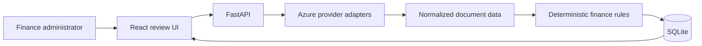
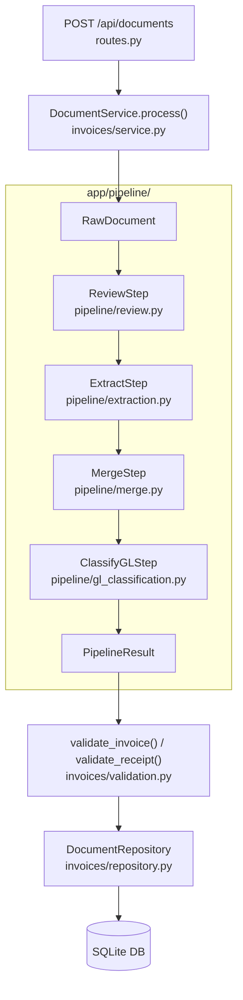

# Invoice Review

This is the clean starter for an end-to-end invoice and receipt review application. You will build a workflow for Northstar Facilities B.V. that combines Azure document extraction, deterministic finance rules, SQLite persistence, and a human review interface.

> You are on `main`, the learner starter. Active work is visible on `development`; the reviewed finished application is on `solution`.

Tutorial: <https://learn.datalumina.com/docs/invoice-review>
Live Demo: <https://ca-invoice-review.ambitiousgrass-0fe56c4f.northeurope.azurecontainerapps.io/>

## Architecture

The system acts as a local full-stack application processing documents via Azure services and applying deterministic business rules.

### Intended Boundaries

- **Provider Adapters**: Normalize Azure responses before data reaches the domain logic.
- **Rules Engine**: Deterministic invoice and receipt rules remain separate from model extraction.
- **Backend Organization**: Routes own HTTP concerns, a service layer owns orchestration, and a repository owns SQLite access.
- **Human in the Loop**: A reviewer explicitly approves, rejects, or requests a supplier correction after seeing evidence and AI uncertainty.

### System Flow



### Extraction Pipeline & AI Usage

The backend processes documents through a sequential four-step pipeline before applying business rules:



1. **`ReviewStep`** (`pipeline/review.py`): Performs an initial independent classification (identifying if the document is an invoice or a receipt) and extracts a standalone set of fields directly from the page via `AzureOpenAIReviewProvider`. This prevents a redundant second LLM pass later.
2. **`ExtractStep`** (`pipeline/extraction.py`): Based on the initial label, it routes the document to either the `prebuilt-invoice` or `prebuilt-receipt` model via `AzureDocumentIntelligenceProvider` to extract raw field data into `Invoice` or `Receipt` schemas.
3. **`MergeStep`** (`pipeline/merge.py`): A deterministic, offline merge where Document Intelligence remains the primary source of truth. The LLM extraction is only used to fill in fields that DI missed. Any conflicts (where both models extracted different values for the same field) are explicitly surfaced to the reviewer rather than silently resolved.
4. **`ClassifyGLStep`** (`pipeline/gl_classification.py`): Sends only the merged fields (not the original file) back to Azure OpenAI via `AzureOpenAIGLProvider` to suggest a General Ledger (GL) account from a fixed Northstar catalog, including a rationale and confidence score.

*Note: Document validation (like checking for duplicates or matching VAT numbers) occurs only after this extraction pipeline completes, keeping deterministic rules fully decoupled from AI extraction.*

## What is included

- The client brief and target architecture
- A fictional 13-document multilingual corpus
- Safe environment templates
- Exact dependency pins and lockfiles
- Backend and frontend project configuration

Application code is intentionally absent. The tutorial builds the backend and frontend from this starting point.

## Prerequisites

- Python 3.12 or newer
- uv
- Node.js 22 or newer
- pnpm 11

## Install

```bash
cd backend
uv sync --locked

cd ../frontend
pnpm install --frozen-lockfile
```

Copy `backend/.env.example` to `backend/.env` and `frontend/.env.example` to `frontend/.env` when the tutorial reaches environment configuration. The backend file contains only Azure provider configuration; the frontend file contains `VITE_API_BASE_URL`. Add real Azure values only when the provider stages require them.

## Verify the starter installation

```bash
cd backend
uv sync --locked

cd ../frontend
pnpm install --frozen-lockfile
```

## Choose a branch

- `main`: clone this branch to follow the tutorial from the prepared starting point.
- `development`: inspect the public working branch and later experiments.
- `solution`: inspect the reviewed end product.

To switch to the finished application:

```bash
git switch solution
```

Start with [the client brief](docs/client-brief.md), then follow the [complete tutorial](https://learn.datalumina.com/docs/invoice-review).

## Deployment

The app is deployed to Azure Container Apps as a single container. See
[docs/deployment.md](docs/deployment.md) for the architecture, the resources it runs on, the
password gate, what does and doesn't survive a restart, and how to ship a new version.
